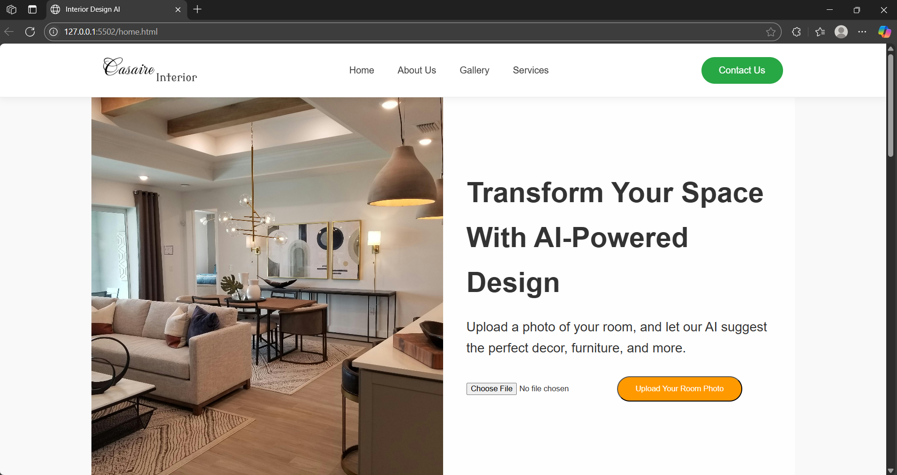
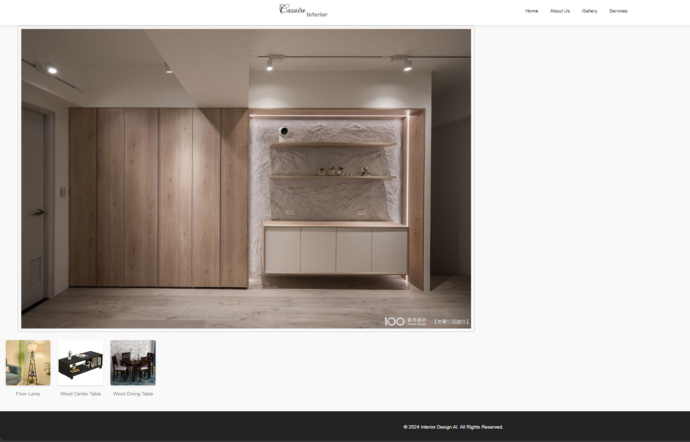

# 🛋️ AI-Powered Interior Design Recommender

This project is an AI-based web application that suggests interior decor items based on uploaded room images. It uses image classification to predict the style (e.g., Modern, Vintage, Aesthetic) and recommends decor accordingly.

---

## 📷 Features

- Upload a room image (bedroom, living room, etc.)
- AI predicts the interior style
- View decor recommendations from the style-specific database
- Preview selected items on your uploaded image
- Fully responsive frontend with a modern UI

---

## 🚀 Tech Stack

- **Frontend**: HTML, CSS, JavaScript
- **Backend**: Node.js, Express.js, FastAPI (Python for AI)
- **Database**: MySQL
- **AI Model**: Trained Keras CNN model for style prediction
- **Other Tools**: Git, GitHub, Google Drive (for model storage)

---

## 🧠 AI Model

The trained model (`ai_model.keras`) is **too large for GitHub**.  
👉 [Download the AI Model from Google Drive] https://drive.google.com/file/d/1eJzqB10jIjbYzTpODEvlpwYieRqSNAvS/view?usp=drive_link

---

## 💡 How It Works

1. User uploads a room photo
2. FastAPI analyzes the image and predicts the interior style
3. Node.js fetches decor items from the corresponding table in MySQL
4. Selected decor items are displayed on the uploaded image

---

## 🛠️ Setup Instructions

1. Clone the repository

   git clone https://github.com/Supritha-Selvaraju/AI-power-interior-recommender.git

2. Install backend dependencies
   
   npm install

3. Start the backend server

   node server.js

4. Run the FastAPI server

   uvicorn ai_predict:app --reload

---

📁 Project Structure

project-root/
│
├── model/                 # AI model (ignored from Git)
├── public/                # Frontend static files
├── html/                  # Frontend HTML pages
├── routes/                # Express.js API routes
├── ai_predict.py          # FastAPI app for AI
├── server.js              # Node.js server
└── README.md              # This file

---

📸 Screenshots

### 🏠 Home Page(before uploading the image)

### 🏠 Home Page(after uploading the image)

### 🪑 Recommendations Page

---

🙋‍♀️ About Me

👩‍💻 Developed by Supritha S
🔗 GitHub Profile: https://github.com/Supritha-Selvaraju